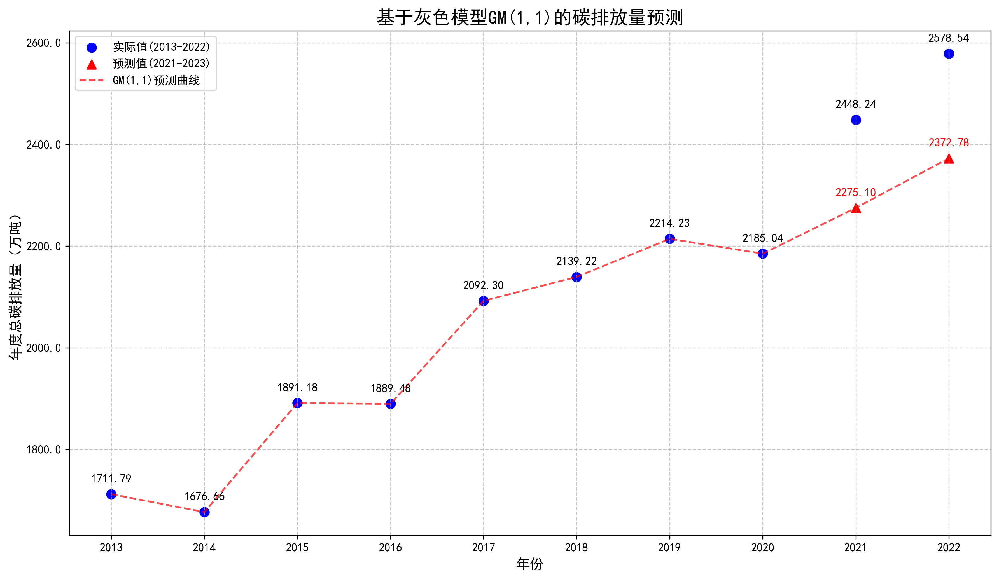
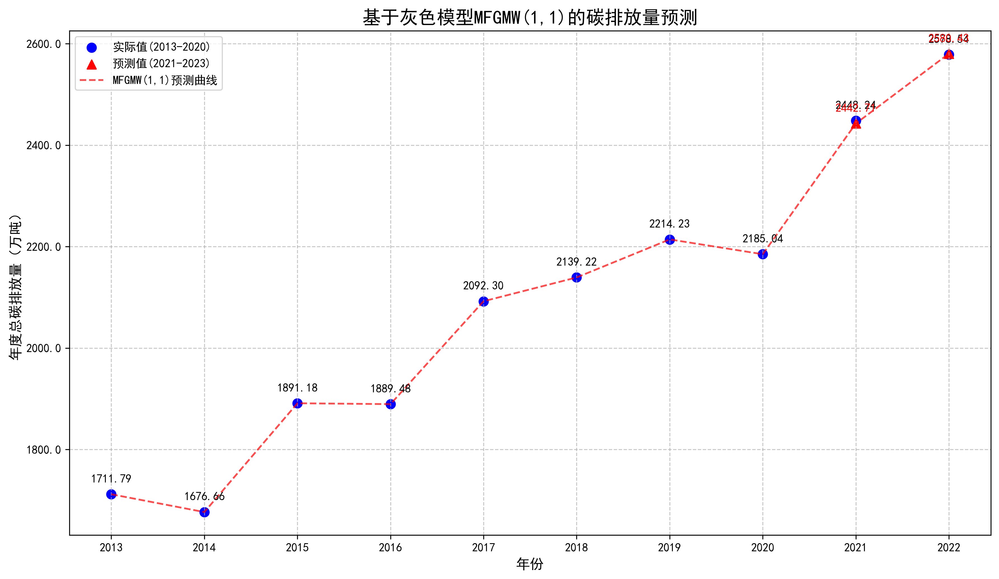

技术栈：模拟退火算法、灰色模型、数据收集、pandas、numpy、matplotlib
数据集来源：[河南省能源消费总量及构成](https://oss.henan.gov.cn/sbgt-wztipt/attachment/hntjj/hntj/lib/tjnj/2024nj/zk/indexch.htm)
效果：优化后的灰色模型预测精度高达99%。

优化前的灰色模型预测：

优化后的灰色模型预测：

